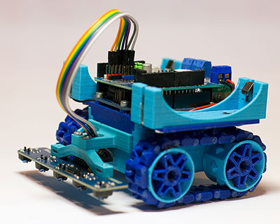

# SMARS

SMARS acronym of “Screwless/Screwed Modular Assemblable Robotic System” is a simple robot designed to the educational field. The main features of SMARS are the reduced number of components, the possibility of mount it without screws and without soldering any part, it doesn’t need glue or similar and it’s really cheap to build. Another main point of SMARS is the modular design. You can mount different sensors and tools and design your own parts. In future I’ll add new modules or DLC to improve the model but It would be nice if you could share your mods too.

[SMARS body 3D models v1](https://cults3d.com/en/3d-model/gadget/smars-modular-robot) or [SMARS body 3D models v4](https://cults3d.com/en/3d-model/gadget/smars-v4)

Author: Kevin Thomas

## Hardware

 

### Electronic

I use Arduino UNO with modified FunduMoto shield. I swapped pins 5 and 10 to use the servo while driving motors using pwm


```
#define PIN_MOTOR_A_EN 5
#define PIN_MOTOR_A_DIR 12
#define PIN_MOTOR_B_EN 11
#define PIN_MOTOR_B_DIR 13
#define PIN_SERVO 9
#define PIN_BUZZER 4
#define PIN_SONAR_TRIG 8
#define PIN_SONAR_ECHO 7
```

### 3D print
[Various additional brackets](stl_addons/)


## Software
[Various code examples](code/)